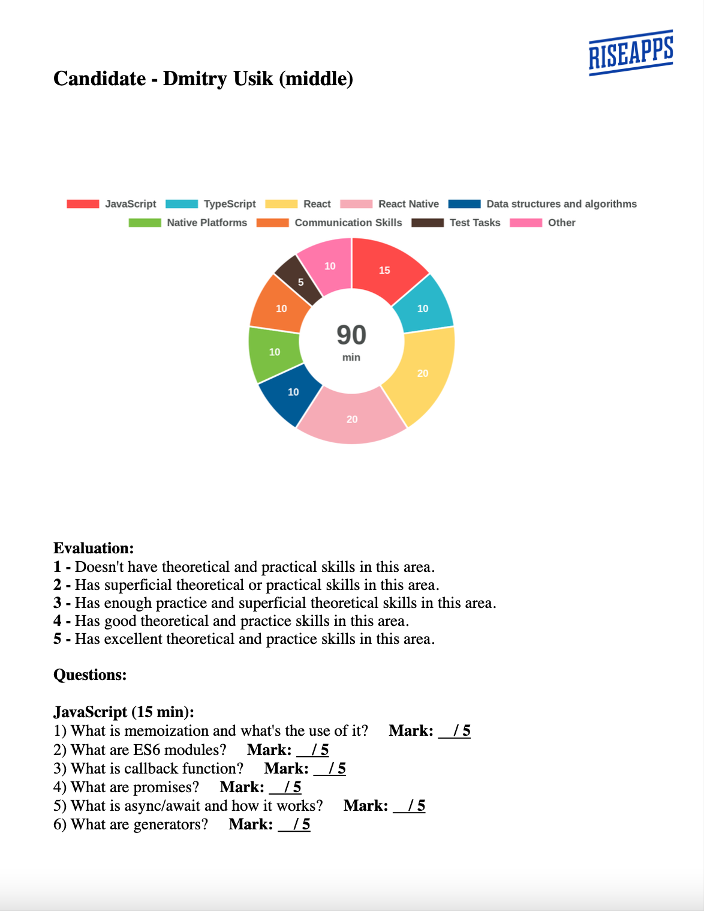
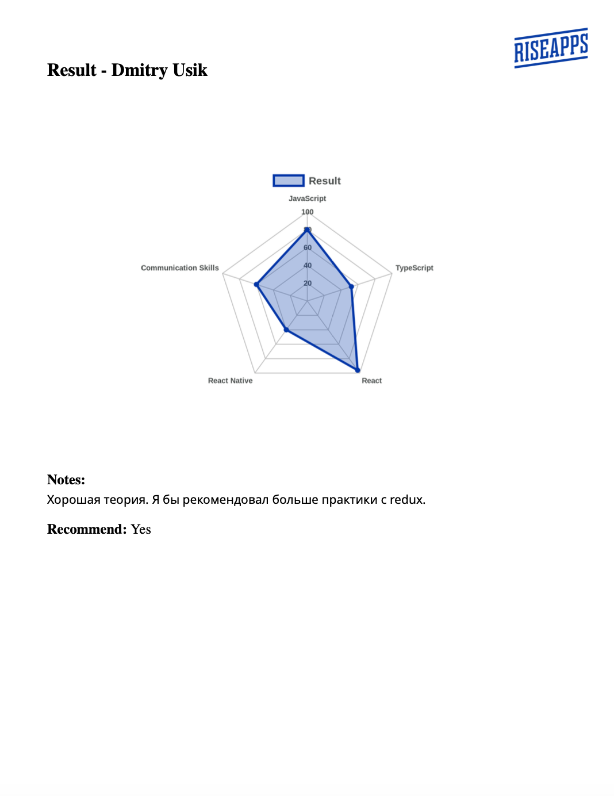

# ReactNativeInterviewsHelper

## Description:

## It solves next problems:
1) 
2)
3)
4)
5)

## How to use it:

## :hammer: Scripts:
| Script | Description |
| :--- | :--- |
| validateQuestionsDB | Validates the questions database. Checks for the correct format for each question in the database. |
| findQuestions | Finds suitable questions based on the input params and puts them to the .txt file. |
| generateInterviewPDF | Generates a PDF document for the interview and .txt drafts for the result. | 
| generateResultPDF | Generates a PDF document with the interview result. |

## Input:

Example:
```json
{
    "role": "middle-",
    "includedTopics": [
        "javascript",
        "typescript",
        "react.redux",
        "reactNative",
        "nativePlatforms",
        "communicationSkills",
        "testTasks"
    ],
    "candidate": {
        "firstname": "Dmitry",
        "lastname": "Usik"
    }
}
```
Allowed values for role:
```typescript
type Role = 'trainee' | 'junior' | 'junior+' | 'middle-' | 'middle' | 'middle+' | 'senior'
```

## Config:

Example:
```json
{
    "notValidQuestionsFilename": "notValidQuestions.txt",
    "questionsFilename": "questions.txt",
    "pieChartFilename": "pieChart.png",
    "radarChartFilename": "radarChart.png",
    "forInterviewerFilename": "forInterviewer.pdf",
    "resultDraftFilename": "resultDraft.txt",
    "resultNotesDraftFilename": "resultNotesDraft.txt",
    "resultFilename": "result.pdf",
    "suitableQuestionMarker": "+ ",
    "pieChart": {
        "width": 700,
        "dataColors": [
            "rgb(254,74,73)",
            "rgb(42,183,202)",
            "rgb(254,215,102)",
            "rgb(246,171,182)",
            "rgb(0,91,150)",
            "rgb(123,192,67)",
            "rgb(243,119,54)",
            "rgb(79,55,45)",
            "rgb(255,119,170)",
            "rgb(74,78,77)"
        ],
        "fontColor": "rgb(74,78,77)",
        "fontSize": 12,
        "fontStyle": "bold",
        "centerFontSize": 32,
        "dataFontColor": "rgb(255, 255, 255)"
    },
    "radarChart": {
        "width": 700,
        "datasetColor": "rgb(0, 54, 167)",
        "datasetBackgroundColor": "rgba(0, 54, 167, 0.3)",
        "fontSize": 10,
        "fontColor": "rgb(74,78,77)",
        "fontStyle": "bold",
        "legendFontSize": 14,
        "gridColor": "rgb(187, 187, 187)",
        "ticksBackgroundColor": "rgba(255, 255, 255, 0.1)"
    },
    "pdfDocument": {
        "creator": "Dmitry Usik",
        "author": "Dmitry Usik",
        "verticalMargin": 64,
        "horizontalMargin": 48,
        "logoWidth": 80,
        "logoMargin": 24
    },
    "maxMark": 5,
    "topicKey": "@topic@",
    "notesKey": "@notes@",
    "recommendKey": "@recommend@"
}
```

## Output examples:
| For interviewer: | Result: |
:-------------------------:|:-------------------------:
| [forInterviewer_example.pdf](forInterviewer_example.pdf) | [result_example.pdf](result_example.pdf) |
|  | | 
